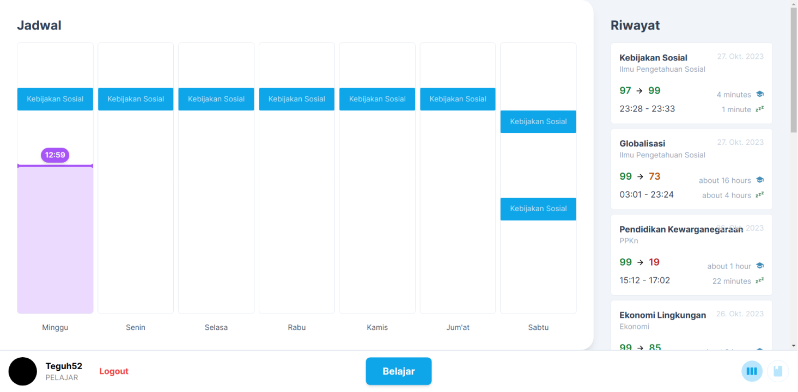
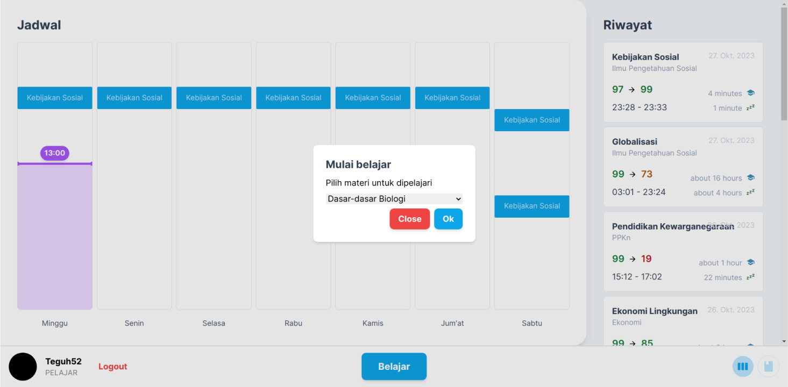
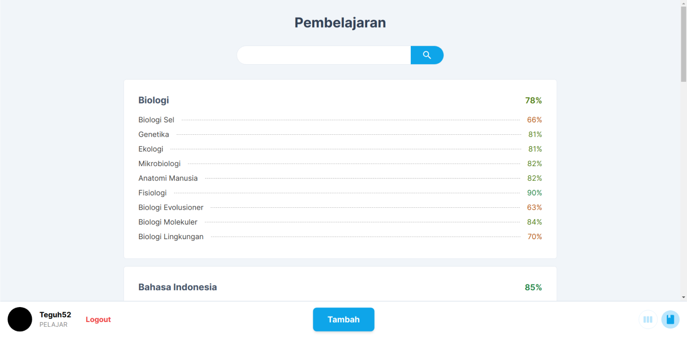
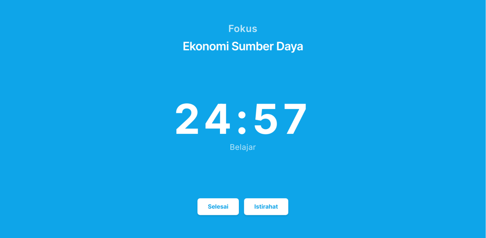

# Straight A

|         |  |
| :----------------------------------------: | :---------------------------------------: |
|  |      |

A failed project that did not make it to the finalists in the Technology Euphoria 2023 Competition and IDN ITFEST 2023. [Here's the proposal if you're interested (Techporia)](https://home.mycloud.com/action/share/9eea3e9e-ef15-4ad5-a9b1-bcd6c5c8b8df), and [IDN ITFEST 2023](https://docs.google.com/document/d/1te3J085AisH8XRC3hUkmp_lvQKEYTxTXzOskf_jXZZE/edit?usp=sharing).

## Quick Look

Straight A is an innovative web app that brings study planning to the next level. It is designed to assign
and arrange study sessions based off of evaluation of previous study sessions. It tries to evaluate and
understand the learning patterns of the user to generate the best possible schedule for the maximum outcome.

It is an assistive web app to coach students to learn independently.

## Status

Proposal mostly covers the references needed to create an MVP, but it has been poorly written and done in a
hurry (we're supposed to participate in the competition 2 months prior to work on the project, but we registered
2 weeks before the deadline lol, I guess that explains how this project didn't get through).

The proposal contains references and a basic algorithm to schedule and arrange study sessions for the user based
on previous study sessions. I believe It's pretty good considering it's written in just two weeks.

The current implementation uses Next.js 13 with the app directory, featuring prisma as the ORM, though
operations like complex aggregation and such are implemented with custom SQL queries, and a full redux
frontend powered with RTK Query.

It currently implements basic functionalities of the actual web app itself like creating materials and
doing study sessions. The actual algorithm for determining the schedule is **almost finished**, but
not working yet.

### IDN ITFEST 2023

I ended the development of Straight A because the proposal didn't get accepted into Technology
Euphoria 2023's finals. But right after that, in about a few weeks later, IDN decided to held the
next annual ITFEST, the IDN ITFEST 2023 competition, a competition of which I won 3rd place before!
(see my repo [iyxan23/idn-itfest-prognosis](https://github.com/iyxan23/idn-itfest-prognosis)).

Seeing this opportunity, I decided to join in to take on this challange to become 1st place. But
disaster struck, well more of an other opportunity... I got accepted to be one of select students
to teach abroad at Malaysia, and the time kinda clashes with ITFEST. Since ITFEST requires us to
submit a proposal first to get into the semifinals, once we've got to that stage, we are given
roughly a week to work on the website and submit it.

It's the same mechanism with Technology Euphoria 2023, the difference is that ITFEST prohibits us
from using any form of framework/library, of where I can't just submit this repo to them, and I
of course had to rework the website to using only Javascript and localStorage shenanigans.

I had the same plan as Techporia, to work on the website in parallel. I wanted to work on the
website at the time we're waiting for the results of our proposal. But that can't happen, since
I got into this rollercoaster ride to Malaysia!

At the end, we actually got into the semifinals, which kinda shocked me a bit! But then we don't
have any website to submit, and I'm busy at Malaysia. We are acutally composed of a team of 3, me
being the leader. Because I wasn't present with my team at the time, we couldn't coordinate
properly, and the rewrite ended up being dismissed, effectively forcing us to submit the nextjs
version to IDN ITFEST.

Nonetheless though, the lessons I've learned from this project is a lot!

## Getting Started

First, run the development server:

```bash
npm run dev
# or
yarn dev
# or
pnpm dev
# or
bun dev
```

Open [http://localhost:3000](http://localhost:3000) with your browser to see the result.

You can start editing the page by modifying `app/page.tsx`. The page auto-updates as you edit the file.

This project uses [`next/font`](https://nextjs.org/docs/basic-features/font-optimization) to automatically optimize and load Inter, a custom Google Font.

## Learn More

To learn more about Next.js, take a look at the following resources:

- [Next.js Documentation](https://nextjs.org/docs) - learn about Next.js features and API.
- [Learn Next.js](https://nextjs.org/learn) - an interactive Next.js tutorial.

You can check out [the Next.js GitHub repository](https://github.com/vercel/next.js/) - your feedback and contributions are welcome!

## Deploy on Vercel

The easiest way to deploy your Next.js app is to use the [Vercel Platform](https://vercel.com/new?utm_medium=default-template&filter=next.js&utm_source=create-next-app&utm_campaign=create-next-app-readme) from the creators of Next.js.

Check out our [Next.js deployment documentation](https://nextjs.org/docs/deployment) for more details.
